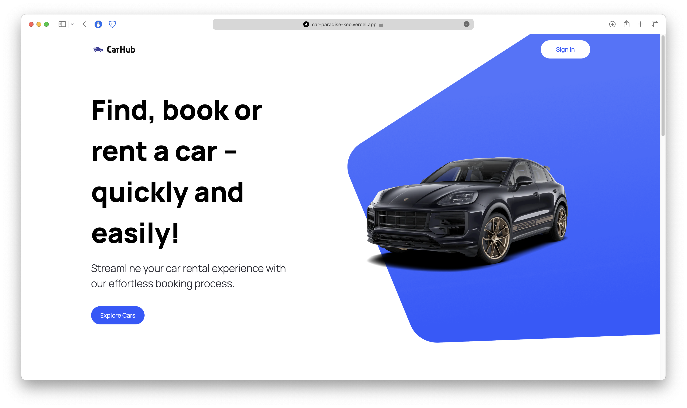
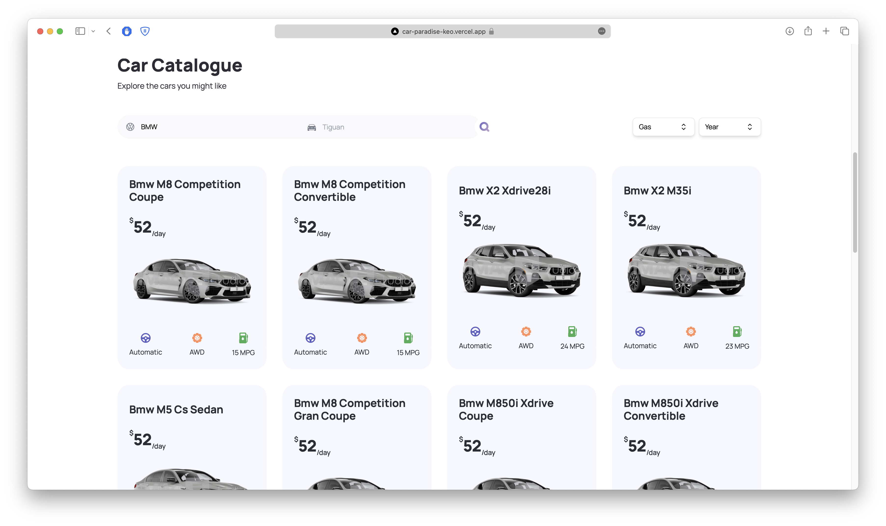

# Car-Hub

## :memo: About

This app allows you to find a vehicle by brand and model. More accurate selection will be provided by 2 custom filters. And the API will provide you with all the information about the car in the form of characteristics and images from different angles.

---
## :desktop_computer: Technologies
* **TypeScript**
* **React**
* **Next.js 13**
* **Tailwind.css**
* **HeadlessUI**

---
## :mag_right: View
You can watch preview [*****here*****](https://car-paradise-keo.vercel.app/)

## :mailbox_with_mail: Contribution

If you find any issues or want to contribute to the project, please create a Pull Request or make an Issue in this repository.